# One_More_Project: AI 기반 개인화 레시피 추천 서비스

## **1. 프로젝트 개요 (Project Overview)**

- 기획 배경: 1인 가구의 증가와 함께 '집밥'에 대한 관심은 높아졌지만, 식재료 관리의 어려움으로 인해 배달 음식이나 레토르트 식품에 의존하는 경향이 여전합니다. 식재료를 소분하고 관리하지 못해 발생하는 음식물 쓰레기는 경제적 손실뿐만 아니라 요리에 대한 심리적 장벽을 높이는 원인이 됩니다.
- 프로젝트 목표: 이러한 문제를 해결하기 위해 AI 기반의 스마트 레시피 추천 서비스를 기획했습니다. 사용자가 냉장고 속 재료를 일일이 입력할 필요 없이 사진 촬영이나 영수증 업로드만으로 간편하게 등록하고, 사용자의 취향(매운맛, 한식 등)이 반영된 최적의 레시피를 제공하여 건강한 식생활과 잔반 감소를 돕고자 합니다.

 

## **2. 기술 스택 (Tech Stack)**

- Infra & Cloud

| Category | Detail |
| --- | --- |
| Cloud | AWS (EC2, ALB, RDS, ACM) |
| OS | Ubuntu 24.04 LTS (EC2) |
| Server | Spring Boot (Port: 8080), FastAPI (Port: 8000) |
| Security | SSL/TLS (HTTPS), Security Group, ngrok (Local-Cloud Tunneling) |

 
 

- Backend

| Category | Detail (Java)                                                                                                                    |
| --- |----------------------------------------------------------------------------------------------------------------------------------|
| **BackEnd** | **Java 17**, **Spring Boot 3.4.1,**                                                                                              |
| **OS** | Ubuntu(EC2)                                                                                                                      |
| **Library & API** | **Spring AI**, **Ollama** (Model: `bge-m3`, `exaone3.5`), **Lombok**, Spring Data JPA,  **RestTemplate** (Server-to-Server Comm) |
| **IDE** | IntelliJ IDEA (Java), VS Code                                                                                                    |
| **Server** | Apache Tomcat (Spring Boot Embedded)                                                                                             |
| **Document** | **Swagger** (SpringDoc OpenAPI 3.0)                                                                                              |
| **CI** | **Gradle** (Build Tool)                                                                                                          |
| **DataBase** | **PostgreSQL** (Relation + **pgvector** Extension)                                                                               |

 
 

- AI-server

| Category | Detail (Python) |
| --- | --- |
| **BackEnd** | **Python3.11, FastAPI** |
| **OS** | **Ubuntu(EC2)** |
| **Library & API** | AI/LLM(Google GenAi, LangChain), **Embedding &** Vector DB (HuggingFace (`jhgan/ko-sroberta-multitask`), **Model Training**(Sentence-Transformers(PyTorch)) |
| **IDE** | **Pycham** |
| **Server** | **Uvicorn** (FastAPI Server) |
| **Document** | **Swagger UI** (Built-in OpenAPI) |
| **CI** | **pip** |
| **DataBase** | **PostgreSQL** (Relation + **pgvector** Extension)                                                                               |

 
 

- Frontend

| Category | Detail (TypeScript)                                                           |
| --- |-------------------------------------------------------------------------------|
| **FrontEnd** | **React Native / Expo**                                                       |
| **OS** | **Android**                                                                   |
| **Library & API** | **Expo Router, React Navigation, React Native Reanimated, Expo Image Picker** |
| **IDE** | **VSCode**                                                                    |
| **Server** | **Node.js**                                                                   |
| **CI** | **npm, EAS (Expo Application Services)**                                                                     |

 
 

## **3. 시스템 아키텍처 & 데이터 흐름(System Architecture & Data Flow)**

3-1 서비스 데이터 플로우:

  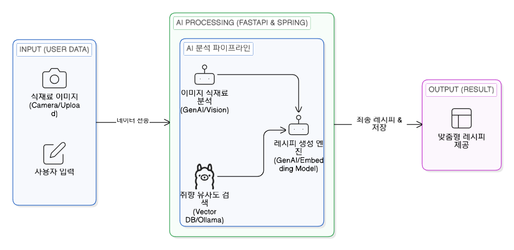

 
 

3-2 시스템 인프라 아키텍처:

  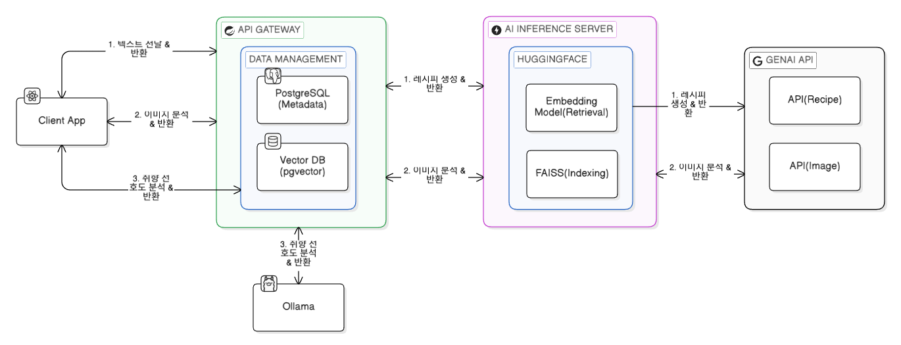

 
 

3-3. AWS 인프라 설계 전략

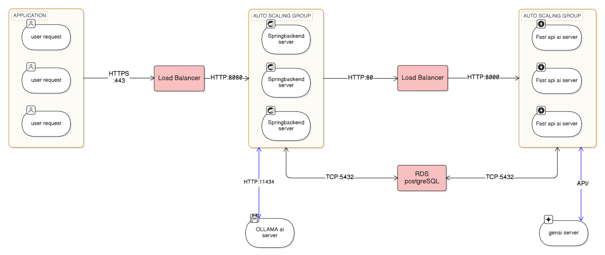

 
 

## 4. 주요 기능 (Key Features)

### 1. 취향 선택

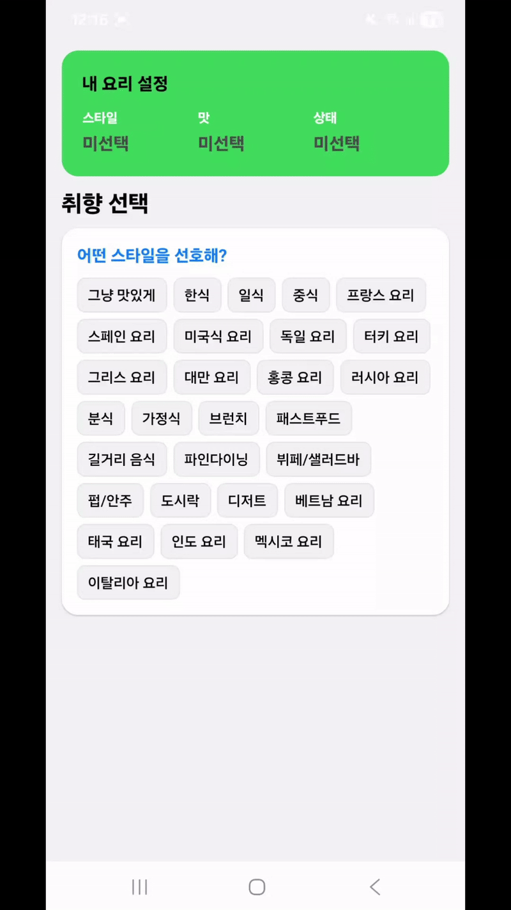

- 음식 종류(style), 음식 취향(taste), 유저 기호(condition)을 입력
- 취향 다시 고르기 기능 구현 (재선택가능)
- 선택한 취향을 기반으로 RAG를 사용해서 추천 재료, 조미료 키워드 생성

 
 

### 2. 식재료 이미지, 영수증 분석

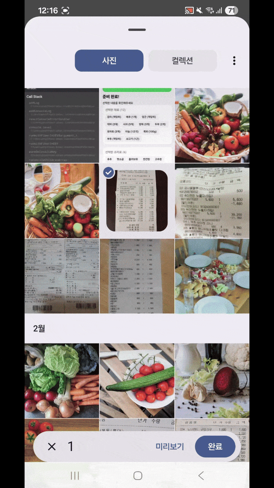
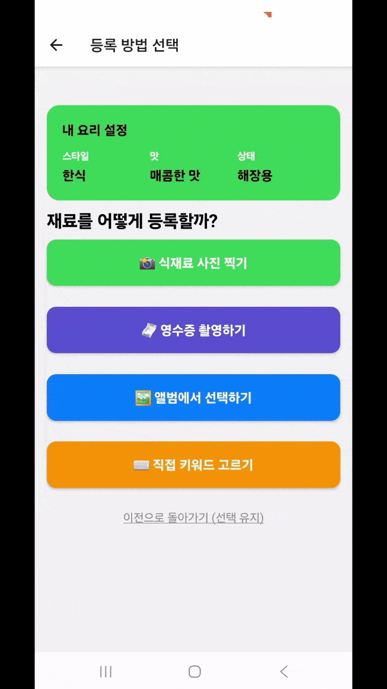

- 직접 촬영 or 앨범에서 선택 둘 다 구현
- 식재료 사진을 찍거나 영수증을 촬영하면 재료의 종류와 수량을 분석
- 조미료는 구분이 불가능하므로 분석 대상 제외

 
 

### 3-A. 분석 재료 수정 / 3-B. 직접 식재료 선택

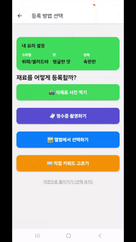

- AI 이미지 분석 결과를 칩(chip)형태로 출력
- 선택하면 수량을 변경하거나 재료 삭제 가능
- 1에서 선택한 취향 기반 AI 키워드 추천 기능 구현
- 유사도 기반 재료 검색 기능 구현
- 유저가 분석한 재료를 직업 확인하고 수정 가능
- 이미지분석 이외에 직접 재료를 골라서 레시피 생성 가능

 
 

### 4. 조미료 선택 / 5. 재료, 조미료 확인/레시피 생성

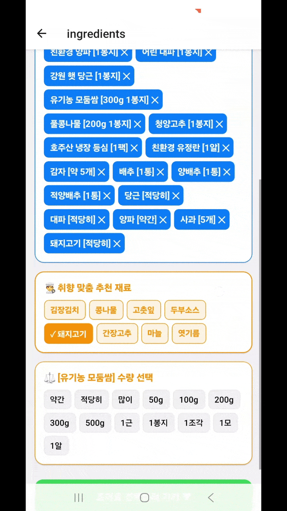
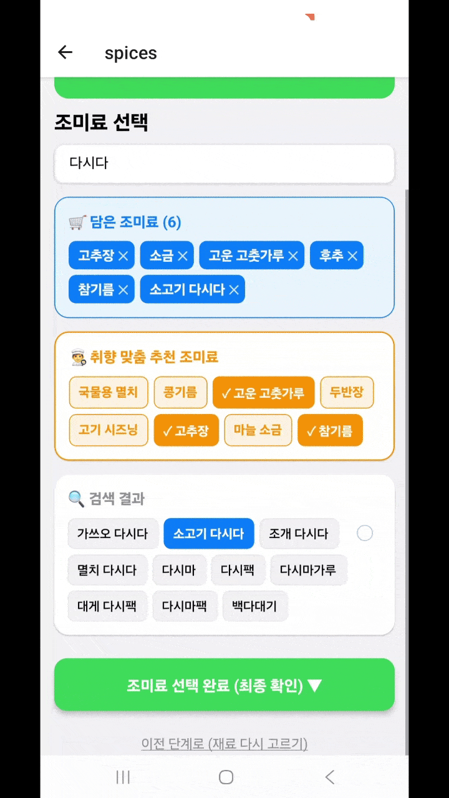

- 조미료는 이미지 분석에서 제외
- 조미료는 유저가 직접 선택 및 수정
- 1에서 선택한 취향 기반 AI 키워드 추천 기능 구현
- 유사도 기반 조미료 검색 기능 구현
- 수량 선택 불가

 
 

### 6-A 기본 방식 레시피 생성

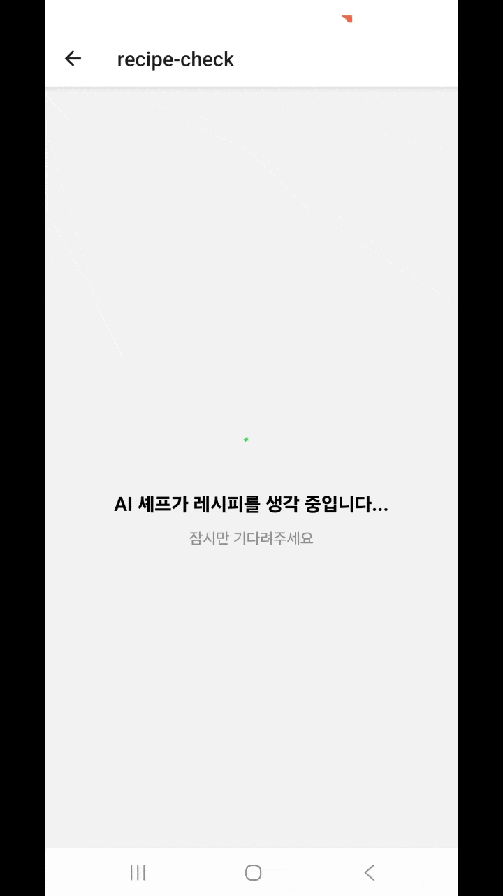

- 유저가 선택한 취향, 재료, 조미료 기반 AI 레시피 3종 생성.
- 1종은 유저가 선택한 재료만으로, 2종은 추가 재료를 더해서 레시피 생성
- 요약 화면에서 3종의 레시피 확인 가능
- 상세 화면에서 1종의 레시피의 요리법과 팁 추가로 확인 가능.

 
 

### 6-B 재료 추가 방식 레시피 생성 / 6-C '만개의 레시피' 레시피 생성

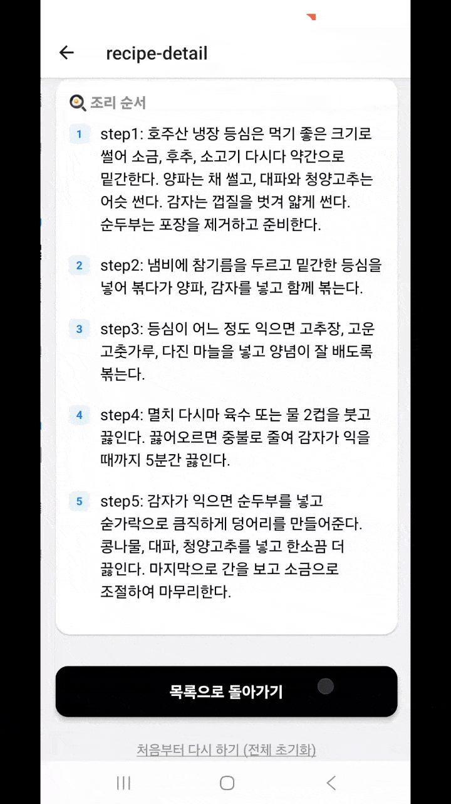
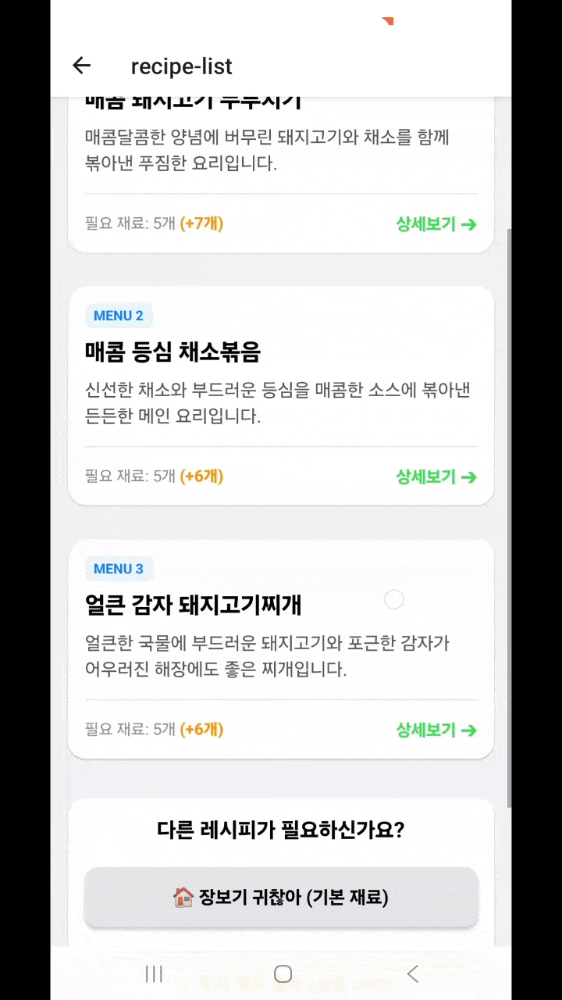

- 추가 재료가 들어간 레시피만 3종 생성
- +N개의 추가 재료 확인 가능
- 실제 ‘만개의 레시피’사이트의 레시피 데이터 출력 구현

 
 

## 5. 트러블 슈팅(Troubleshooting)
- [이미지 전송 오류](assets/이미지%20전송%20에러%20301df1d0a3478072ba9bfe948b97696a.md)
>- 422 Unprocessable Content: [no body] 에러
>- HTTP 전송 객체 문제
- LangChain Google API 기반 임베딩 처리 과정 시, 대량의 레시피 데이터를 처리할 때 발생하는 토큰 제한 및 API 호출 비용 이슈가 발생.
>- `HuggingFaceEmbeddings` 라이브러리를 활용해 모델(`jhgan/ko-sroberta-multitask`)을 로컬 환경에서 직접 구동하도록 처리

 
 

## 6. AWS 인프라 구축 및 운영 상세 (Infrastructure)

- 각 팀원마다 50$를 제공하는 AWS Academy Learner Lab 계정을 사용함.

 
 

### 6.1 가용성 및 확장성

- Auto Scaling Group: us-east-1a, 1b 가용 영역 분산 및 AMI 기반 인스턴스 자동 확장 환경 조성.
- AI 부하 분산: FastAPI 클러스터를 별도 로드밸런서 하단에 배치하여 대량 분석 요청 처리 성능 확보.

(AI Server 로드밸런싱 설정 확인)

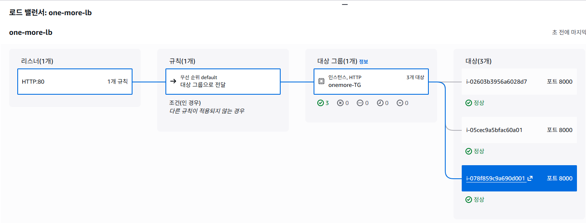

 
 

(다중 서버 인스턴스에서 동시 요청을 처리하는 로그 확인)

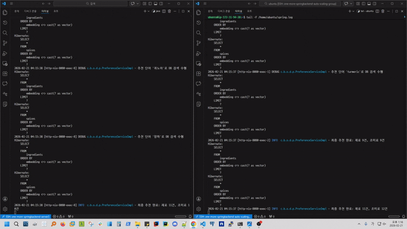

 
 

- 인스턴스 사이징: JVM 런타임 안정성 및 초기 부팅 리소스 부하를 고려한 t3.medium 규격 채택.
- 상태 검사(Health Check): 애플리케이션 내 전용 엔드포인트(/health) 구축을 통한 실시간 가동 상태 검증 및 자동 복구.
- 하이브리드 통신: 다수의 고성능 AI모델(EXAONE 3.5:7.8B)를 안정적으로 사용할 수 있는 EC2서버를 확보할 수 없어서, AI모델을 로컬PC에 배치하고 ngrok 터널링 기반 클라우드 백엔드와 로컬 AI 서버(Ollama) 간 보안 인터페이스 구축.

 
 

### 6.2 데이터 및 AI 인터페이스

- DB 통합 운영: 비용 절감을 위해 단일 Managed RDS(PostgreSQL) 엔드포인트 구성을 통한 팀 내 데이터 정합성 유지.
- 벡터 검색 최적화: pgvector 확장을 활용한 레시피 임베딩 데이터 저장 및 유사도 검색 기능 구현.

 
 

### 6.3 네트워크 및 보안
> - 안드로이드 9.0 이상의 Cleartext HTTP 차단 정책에 의해, HTTPS 환경을 구축

 

- ALB에 HTTPS리스터를 연결하기 위해, 보유중인 도메인(가비아)를 이용해서 ACM을 발급

( 외부 도메인(가비아)으로 ACM발급 후 CNAME 등록)

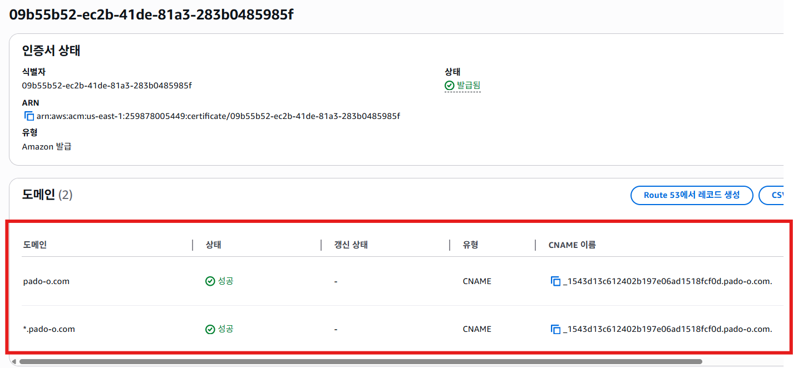

 
 

- 클라이언트와 로드밸런서 구간만 HTTPS를 유지하고, 내부 네트워크 구간은 HTTP로 통신하는 SSL Termination 구조.

(ALB 리스너 및 타겟 그룹 설정 확인)

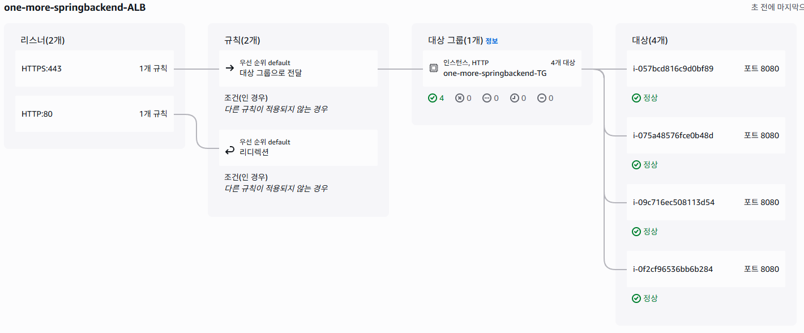

 
 

> - AWS 서비스 사용 불가

- Learner Lab 환경의 IAM 정책(CloudFront 권한 제한 및 Route 53 호스팅 영역 생성 불가)

(CluodFront 사용 불가)

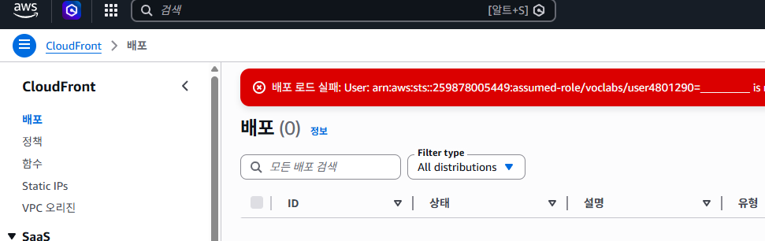

 
 

- api.pado-o.com은 백엔드 로드밸런서(ALB)로, www.pado-o.com 프론트엔드 정적 호스팅(S3)으로 각각 매핑

(가비아 DNS 설정)

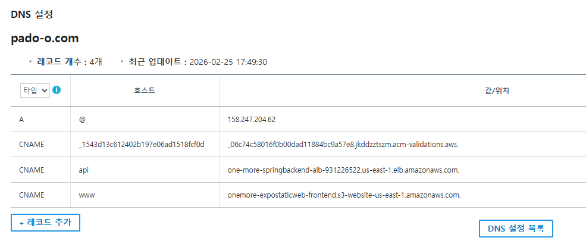

 
 

- 보안 그룹 계층화: ALB(80, 443), EC2(8080), RDS(5432) 간 인바운드 소스 참조 설정을 통한 네트워크 격리.
> - ALB 계층: Public 서브넷에 위치하며, 외부 사용자로부터 80/443 포트 접속을 수용하고 SSL/TLS 복호화 수행.
> - EC2 계층: 인바운드 소스를 ALB 보안 그룹 ID로 제한하여, 로드밸런서를 우회하는 직접적인 WAS 접속 시도를 원천 차단.
> - RDS 계층: 인바운드 소스를 WAS(EC2) 보안 그룹 ID로 특정하여, 데이터베이스 계층을 외부 네트워크로부터 완전히 격리.

(EC2 보안 그룹 계층화)

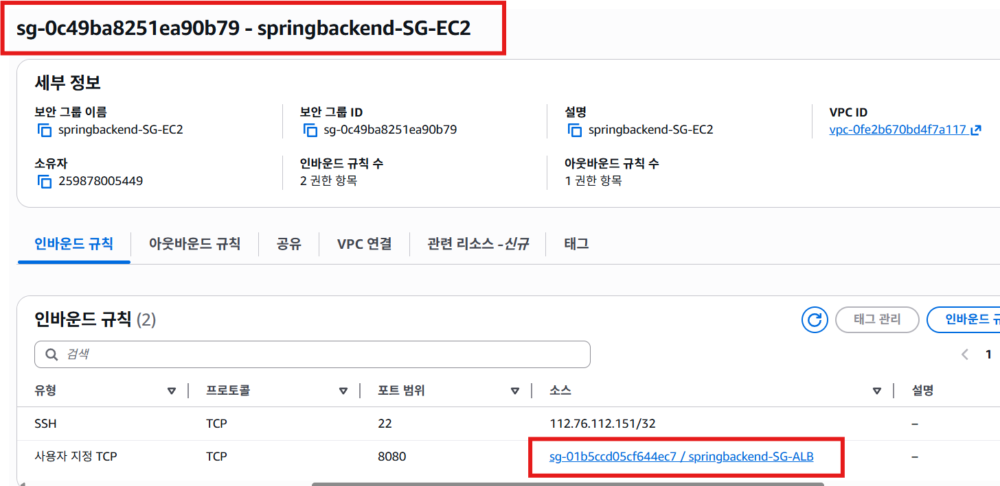

